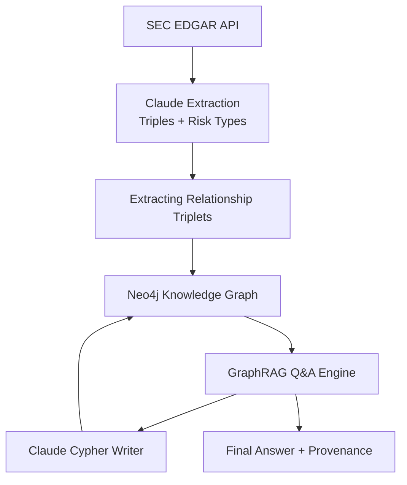
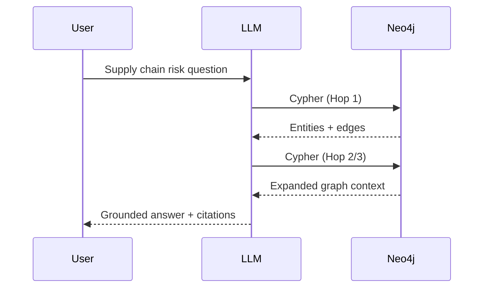

# SupplyShield
### Graph-Powered Supply Chain Risk Intelligence

> Extract → Structure → Traverse → Answer.  
> From SEC filings to geopolitical impact analysis, in three hops.

[](https://python.org)
[](https://neo4j.com)
[](https://anthropic.com)
[](https://streamlit.io)

---

## What This Is

SupplyShield is a ** GraphRAG system** that answers supply chain risk questions by traversing a knowledge graph built from SEC filings.

The system ingests 10-K, 10-Q, and 8-K filings for 9 FAANG+ companies, extracts typed knowledge graph triples via LLM, loads them into Neo4j with full document provenance, and then answers questions by having an LLM dynamically write and iterate Cypher queries across multiple hops.

**The demo question:**

> *"If TSMC is disrupted, which companies lose the most revenue?"*

The system traverses: `(TSMC) ←[SOLE_SOURCE_FROM]— (Apple Inc.) —[GENERATES_REVENUE_FROM]→ (iPhone $201B)` — citing the exact 10-K accession number and paragraph that proves each edge.

---

## Why This Is Hard

Standard RAG (embed → chunk → similarity search) cannot answer this question. It retrieves documents — it cannot reason about chains of dependency. This project demonstrates three things most RAG demos avoid:

**1. Structured extraction at scale**  
LLMs produce structured `(subject, predicate, object)` triples from unstructured legal prose, with 9 specific risk relation types (`TARIFF_RISK`, `EXPORT_CONTROL_RISK`, `GEOGRAPHIC_CONCENTRATION_RISK`, etc.) 

**2. Multi-hop graph reasoning**  
The LLM writes its own Cypher from a schema description for daptive graph exploration. After each hop it decides whether to expand, which nodes to target next, and what relationship types to traverse. 

**3. Line-level provenance**  
Every edge in the graph carries the `accession_number`, `document_url`, and `source_text` excerpt that created it. Every answer can be traced to a specific paragraph of a specific SEC filing.

---

## Architecture




## Query Flow



---

## Knowledge Graph Schema

### Node Labels

| Label | Description | Example |
|-------|-------------|---------|
| `Company` | FAANG+ companies | `Apple Inc.` |
| `Supplier` | Hardware/chip suppliers | `TSMC`, `Foxconn` |
| `Location` | Countries, cities, facilities | `Hsinchu, Taiwan` |
| `Product` | Revenue-generating products | `iPhone`, `H100 GPU` |
| `Person` | Executives | `Tim Cook` |
| `Risk` | Named risk factors | `Single-source TSMC dependency` |
| `RevenueSegment` | Business segments | `Data Center`, `Services` |
| `Regulation` | Laws, frameworks | `Export Administration Regulations` |
| `Filing` | SEC filing provenance node | accession `0000320193-26-000005` |

### Relationship Types

```
── Supply Chain Structure ──────────────────────────────────────
SOLE_SOURCE_FROM        Company depends on ONE supplier for a component
MANUFACTURES            Supplier/company makes a product
SUPPLIES                Supplier provides components to company
PROVIDES                General provision relationship

── Risk (9 specific types ) ───────────────
TARIFF_RISK                    Tariffs, import duties, trade measures
EXPORT_CONTROL_RISK            Export controls, entity list, sanctions
GEOGRAPHIC_CONCENTRATION_RISK  Manufacturing concentrated in one region
SINGLE_SOURCE_RISK             Single-supplier dependency
COMPONENT_SUPPLY_RISK          Semiconductor / component shortage
CYBERSECURITY_RISK             Cyber threats, data breaches
FX_RISK                        Foreign exchange / currency exposure
REGULATORY_RISK                Regulatory compliance, antitrust
OPERATIONAL_RISK               All other operational risks

── Revenue / Financial ─────────────────────────────────────────
GENERATES_REVENUE_FROM  Company earns from product/segment
HAS_REVENUE_SEGMENT     Company has business segment

── Location / Corporate Structure ─────────────────────────────
LOCATED_IN              Facility or operation in location
HEADQUARTERED_IN        Corporate headquarters
SUBSIDIARY_OF           Corporate parent relationship
ACQUIRED                M&A relationship

── Events / People ─────────────────────────────────────────────
APPOINTED_AS            Executive appointment
TRANSITIONS_TO          Role transition
```

### Edge Properties (every relationship)

```
accession_number   "0000320193-26-000005"   ← exact SEC filing identifier
document_url       "https://www.sec.gov/Archives/..."  ← direct document link
source_text        "The Company relies on TSMC..."     ← ≤200 char excerpt
filing_date        "2026-01-29"
filing_form        "10-K"
filing_company     "Apple Inc."
section            "risk_factors"
severity           "HIGH" | "MEDIUM" | "LOW"
```

---

## Multi-Hop Reasoning — How It Actually Works

The Q&A engine is not a router that picks from pre-written queries. The LLM receives the full graph schema and writes Cypher from scratch. After seeing the results, it decides whether to expand — and if so, which specific nodes to target next.

### Example trace: *"If TSMC is disrupted, which companies lose the most revenue?"*

**Hop 1 — LLM writes:**
```cypher
MATCH (s:Supplier {name: 'TSMC'})<-[r:SOLE_SOURCE_FROM]-(c:Company)
RETURN c.name AS company, r.source_text AS evidence, r.document_url AS source
```
→ Returns: `[Apple Inc., NVIDIA Corp, Broadcom Inc.]`

**Hop 2 — LLM decides:** *"I have exposed companies. Now I need their revenue quantification."*
```cypher
MATCH (c:Company)-[r:GENERATES_REVENUE_FROM]->(seg)
WHERE c.name IN ['Apple Inc.', 'NVIDIA Corp', 'Broadcom Inc.']
RETURN c.name, seg.name, r.filing_date, r.source_text
ORDER BY r.filing_date DESC
```
→ Returns: `[iPhone $201B · Data Center $35B · Semiconductor $28B]`

**Hop 3 — LLM decides:** *"I need their documented Taiwan concentration risk language."*
```cypher
MATCH (c:Company)-[r:GEOGRAPHIC_CONCENTRATION_RISK]->(risk)
WHERE c.name IN ['Apple Inc.', 'NVIDIA Corp', 'Broadcom Inc.']
RETURN c.name, risk.name, r.source_text, r.document_url
```
→ Returns: specific risk factor text + SEC document URLs

**Synthesis:** Grounded answer citing filing dates and accession numbers.

---


## Setup

### Prerequisites

- Python 3.11+
- [Neo4j AuraDB Free](https://neo4j.com/cloud/aura/) instance
- Anthropic API key


---


## Design Decisions

### Why Neo4j over a vector store?

Supply chain risk is fundamentally a graph problem. The question *"which companies are exposed to a Taiwan disruption?"* requires traversing: `Location → Supplier → Company → RevenueSegment`. No similarity search can do this — you need edges.

Vector stores excel at retrieval. Graphs excel at reasoning about relationships. This system needs both: graph traversal for multi-hop reasoning, LLM synthesis for natural language answers.


---


## What's Next

- [ ] **GDELT integration** — real-time news events as `(:Event)-[:DISRUPTS]->(:Location)` nodes, triggering automatic impact propagation queries
- [ ] **RAGAS evaluation** — baseline flat vector RAG vs GraphRAG on a held-out question set, measuring faithfulness and answer relevance
- [ ] **Embeddings layer** — semantic search over `source_text` excerpts for questions that don't map cleanly to graph structure
- [ ] **Quarterly refresh** — automated pipeline to pull new 10-Q/8-K filings and merge into existing graph without full reload

---
